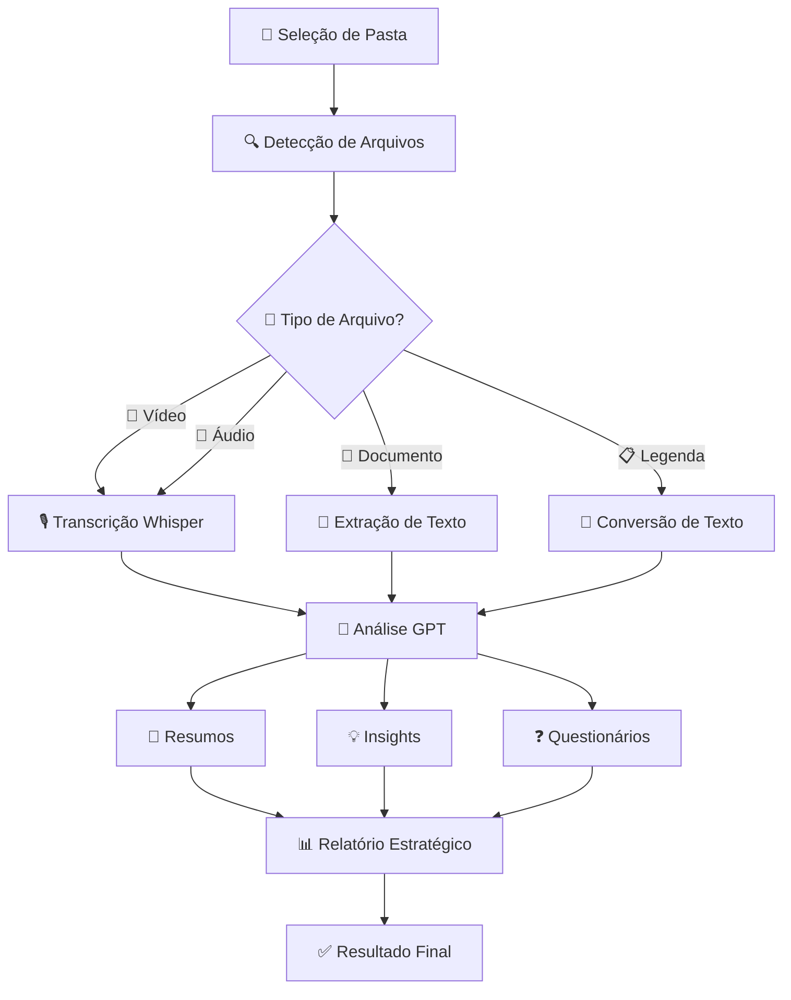

# 🎓 Analisador de Cursos v4.0 ULTIMATE

<div align="center">


**Sistema Inteligente de Análise de Cursos com IA Avançada**

*Transforme qualquer curso em material de estudo estruturado e insights estratégicos*

[🚀 Demonstração](#-funcionalidades) • [📋 Instalação](#-instalação) • [📖 Documentação](#-como-usar) • [🤝 Contribuir](#-contribuindo)

</div>

---

## 🌟 Visão Geral

O **Analisador de Cursos v4.0 ULTIMATE** é uma aplicação revolucionária que utiliza inteligência artificial para transformar conteúdo educacional em material de estudo estruturado e insights estratégicos. Suporta múltiplos formatos de mídia e oferece análises profundas para otimizar o aprendizado.

### 🎯 **Por que usar?**

- ⚡ **Economia de Tempo**: Gere resumos, insights e questionários automaticamente
- 🧠 **IA Avançada**: Integração com GPT-4, GPT-3.5 Turbo e Whisper
- 📚 **Multi-Formato**: Vídeos, áudios, PDFs, Word, PowerPoint e legendas
- 📊 **Análise Estratégica**: Relatórios executivos completos sobre cursos
- 🎨 **Interface Moderna**: Dashboard interativo e intuitivo
- 🔄 **Processamento em Lote**: Analise cursos inteiros de uma vez

---

## ✨ Funcionalidades

### 🎙️ **Transcrição Automática**
- **Whisper Integration**: Transcrição automática de vídeos e áudios
- **Múltiplos Modelos**: tiny, base, small, medium, large
- **Legendas Inteligentes**: Conversão automática de legendas para texto
- **Processamento Paralelo**: Transcrição simultânea de múltiplos arquivos

### 🧠 **Análise de IA Avançada**
- **Resumos Inteligentes**: Sínteses didáticas estruturadas por módulo
- **Insights Estratégicos**: Pontos-chave, aplicações práticas e conexões
- **Questionários Adaptativos**: Testes baseados na Taxonomia de Bloom
- **Análise de Sentimento**: Detecção automática de área e público-alvo

### 📊 **Relatórios Estratégicos**
- **Análise Executiva Completa**: Relatórios de até 3000 palavras
- **Roadmap de Aprendizado**: Cronogramas personalizados
- **Avaliação de ROI**: Análise custo-benefício educacional
- **Benchmark de Mercado**: Comparação com cursos similares

### 🎯 **Suporte Multi-Formato**
| Tipo | Formatos Suportados | Processamento |
|------|---------------------|---------------|
| **Vídeo** | MP4, AVI, MOV, MKV, WebM | Transcrição + Metadados |
| **Áudio** | MP3, WAV, M4A, FLAC, OGG | Transcrição Direta |
| **Documentos** | PDF, DOCX, PPTX | Extração de Texto |
| **Legendas** | SRT, VTT, ASS, SUB | Conversão para Texto |

### 🔧 **Funcionalidades Técnicas**
- **Cache Inteligente**: Sistema de cache para otimização de performance
- **Processamento Orquestrado**: Pipeline automatizado completo
- **Monitoramento de Tokens**: Controle de custos de API em tempo real
- **Sistema de Logs**: Rastreamento detalhado de processamento
- **Backup Automático**: Proteção contra perda de dados

---

## 🚀 Instalação

### 📋 **Pré-requisitos**

- **Python 3.8+**
- **FFmpeg** (para processamento de vídeo/áudio)
- **Chave de API OpenAI**
- **4GB RAM** (recomendado 8GB+)
- **Espaço em disco**: 2GB+ livres

### 🛠️ **Instalação Rápida**

1. **Clone o repositório**
```bash
git clone https://github.com/Rancoroso-X/video.curso_analyzer.git
cd video.curso_analyzer
```

2. **Crie ambiente virtual**
```bash
python -m venv venv
source venv/bin/activate  # Linux/Mac
# ou
venv\Scripts\activate     # Windows
```

3. **Instale dependências**
```bash
pip install -r requirements.txt
```

4. **Configure variáveis de ambiente**
```bash
cp .env.example .env
# Edite o arquivo .env com suas configurações
```

5. **Execute a aplicação**
```bash
streamlit run app.py
```

### 🔧 **Instalação Avançada**

#### **FFmpeg (Obrigatório)**

**Windows:**
```bash
# Via Chocolatey
choco install ffmpeg

# Ou baixe de: https://ffmpeg.org/download.html
```

**macOS:**
```bash
brew install ffmpeg
```

**Linux (Ubuntu/Debian):**
```bash
sudo apt update
sudo apt install ffmpeg
```

#### **Dependências Opcionais**

Para suporte completo a documentos:
```bash
# Processamento de PDF
pip install PyMuPDF

# Processamento de Word
pip install python-docx

# Processamento de PowerPoint
pip install python-pptx
```

---

## ⚙️ Configuração

### 🔑 **Configuração da API OpenAI**

1. **Obtenha sua chave**: [OpenAI API Keys](https://platform.openai.com/api-keys)

2. **Configure o arquivo `.env`**:
```env
# === CONFIGURAÇÕES OBRIGATÓRIAS ===
OPENAI_API_KEY=sk-sua-chave-aqui
OPENAI_ORG_ID=org-sua-organizacao  # Opcional

# === CONFIGURAÇÕES DE IA ===
DEFAULT_GPT_MODEL=gpt-3.5-turbo
DEFAULT_TEMPERATURE=0.3
DEFAULT_MAX_TOKENS_SUMMARY=400
DEFAULT_MAX_TOKENS_INSIGHTS=600
DEFAULT_MAX_TOKENS_QUIZ=700

# === CONFIGURAÇÕES WHISPER ===
DEFAULT_WHISPER_MODEL=small
DEFAULT_WHISPER_LANGUAGE=pt

# === CONFIGURAÇÕES DE SISTEMA ===
MAX_FILE_SIZE_MB=500
MAX_THREADS=4
ENABLE_CACHE=true
DEBUG_MODE=false
```

### 🎛️ **Configurações Avançadas**

<details>
<summary>📊 <strong>Configurações de Performance</strong></summary>

```env
# Cache e Performance
CACHE_TTL_SECONDS=3600
MAX_CACHE_SIZE_MB=1024
CLEANUP_INTERVAL_HOURS=24

# Rate Limiting
OPENAI_REQUESTS_PER_MINUTE=60
WHISPER_REQUESTS_PER_HOUR=100
FILE_PROCESSING_CONCURRENT=5

# Processamento
CHUNK_SIZE_MB=10
PARALLEL_PROCESSING=true
GPU_ACCELERATION=false  # Para Whisper
MEMORY_LIMIT_MB=4096
```
</details>

<details>
<summary>🔒 <strong>Configurações de Segurança</strong></summary>

```env
# Segurança
MAX_UPLOAD_SIZE_MB=500
SCAN_UPLOADS_FOR_MALWARE=false
ENCRYPT_API_KEYS=true

# Backup
BACKUP_INTERVAL_HOURS=24
BACKUP_PATH=./backups
ENABLE_TELEMETRY=false
```
</details>

---

## 📖 Como Usar

### 🎬 **Início Rápido (5 minutos)**

1. **Abra a aplicação**
   ```bash
   streamlit run app.py
   ```

2. **Selecione pasta do curso**
   - Use o campo "📂 Caminho da pasta" na sidebar
   - Ou clique em "📂 Abrir Seletor de Pastas"

3. **Escolha o modo**
   - ✅ **Multi-Formato**: Vídeos + Áudios + Documentos + Legendas
   - 📹 **Tradicional**: Apenas vídeos

4. **Execute processamento completo**
   - Clique em "🚀 Processar Curso Completo"
   - Aguarde a magia acontecer! ✨

### 📚 **Guia Detalhado**

#### **1. 📁 Estrutura de Pastas Recomendada**
```
Meu_Curso/
├── 01_Introducao/
│   ├── aula01.mp4
│   ├── aula01.srt
│   └── slides01.pdf
├── 02_Fundamentos/
│   ├── aula02.mp4
│   ├── material.docx
│   └── exercicios.pdf
└── 03_Pratica/
    ├── demo.mp4
    └── codigo.zip
```

#### **2. 🎙️ Processamento de Transcrição**

**Configurações Recomendadas:**
- **Modelo Whisper**: `small` (boa qualidade/velocidade)
- **Formato Áudio**: `MP3` (menor tamanho)
- **Deletar Áudios**: ✅ (economizar espaço)

**Tempos Estimados:**
- `tiny`: 2-5x mais rápido, qualidade básica
- `small`: Ideal para português brasileiro
- `large`: Melhor qualidade, 3-5x mais lento

#### **3. 🧠 Análise de IA**

**Configurações por Tipo de Curso:**

| Tipo | Tokens Resumo | Tokens Insights | Tokens Quiz | Temperature |
|------|---------------|-----------------|-------------|-------------|
| **Programação** | 550 | 750 | 850 | 0.2 |
| **Business** | 500 | 700 | 800 | 0.3 |
| **Design** | 480 | 680 | 750 | 0.4 |
| **Geral** | 400 | 600 | 700 | 0.3 |

#### **4. 📊 Interpretando Resultados**

**Estrutura de Saída:**
```
curso/
├── analises_ia/
│   ├── modulo_1/
│   │   ├── aula_1/
│   │   │   ├── RESUMO.md
│   │   │   ├── INSIGHTS.md
│   │   │   └── QUESTIONARIO.md
│   └── consolidados/
│       └── ANALISE_ESTRATEGICA_COMPLETA.md
├── relatorios/
└── logs/
```

### 💡 **Dicas de Uso**

<details>
<summary>🎯 <strong>Otimizando Performance</strong></summary>

- **Use SSD** para armazenamento
- **16GB RAM** para cursos grandes (50+ vídeos)
- **GPU** acelera Whisper (modelos large)
- **Conexão estável** para API OpenAI
- **Processe em lotes** pequenos se tiver limitações
</details>

<details>
<summary>💰 <strong>Gerenciando Custos da API</strong></summary>

- **GPT-3.5 Turbo**: ~$0.002/1K tokens (mais econômico)
- **GPT-4**: ~$0.03/1K tokens (melhor qualidade)
- **Whisper**: ~$0.006/minuto
- **Use preview** com poucos arquivos primeiro
- **Monitor de tokens** em tempo real na interface
</details>

<details>
<summary>🚀 <strong>Casos de Uso Avançados</strong></summary>

1. **Universidades**: Analisar disciplinas completas
2. **Empresas**: Onboarding e treinamentos
3. **Creators**: Análise de cursos para melhorias
4. **Estudantes**: Material de revisão personalizado
5. **Consultores**: Auditoria de qualidade educacional
</details>

---

## 🏗️ Arquitetura

### 📦 **Estrutura do Projeto**

```
video.curso_analyzer/
├── 📄 app.py                 # Interface principal Streamlit
├── 🔧 config.py              # Configurações centralizadas
├── 🎙️ transcriber.py         # Sistema de transcrição Whisper
├── 🧠 llm_processor.py       # Processamento IA (OpenAI)
├── 📁 file_processor.py      # Processador multi-formato
├── 🎯 analyzer.py            # Análise de estrutura
├── 📊 logger.py              # Sistema de relatórios
├── 🚀 orchestrated_processor.py  # Pipeline automatizado
├── 📋 requirements.txt       # Dependências Python
├── ⚙️ .env.example          # Template de configuração
└── 📖 README.md             # Esta documentação
```

### 🔄 **Fluxo de Processamento**



### 🛠️ **Tecnologias Utilizadas**

| Categoria | Tecnologia | Versão | Uso |
|-----------|------------|--------|-----|
| **Frontend** | Streamlit | 1.28+ | Interface web interativa |
| **IA/ML** | OpenAI API | 1.3+ | GPT-4, GPT-3.5, Whisper |
| **Processamento** | FFmpeg | Latest | Manipulação de vídeo/áudio |
| **Documentos** | PyMuPDF | 1.23+ | Processamento de PDF |
| **Documentos** | python-docx | 0.8+ | Processamento de Word |
| **Documentos** | python-pptx | 0.6+ | Processamento PowerPoint |
| **Cache** | diskcache | 5.6+ | Cache inteligente |
| **Paralelo** | ThreadPoolExecutor | Built-in | Processamento concorrente |

---

## 📊 Performance & Benchmarks

### ⚡ **Tempos de Processamento**

| Cenário | Arquivos | Duração | Tempo Transcrição | Tempo IA | Total |
|---------|----------|---------|-------------------|----------|-------|
| **Curso Pequeno** | 10 vídeos | 5h | 15 min | 8 min | **23 min** |
| **Curso Médio** | 50 vídeos | 25h | 1h 15min | 35 min | **1h 50min** |
| **Curso Grande** | 100 vídeos | 50h | 2h 30min | 1h 10min | **3h 40min** |

### 💰 **Estimativa de Custos (OpenAI)**

| Modelo | Tokens/Hora Curso | Custo/Hora | Curso 10h | Curso 50h |
|--------|-------------------|------------|-----------|-----------|
| **GPT-3.5 Turbo** | ~15K | $0.03 | **$0.30** | **$1.50** |
| **GPT-4** | ~15K | $0.45 | **$4.50** | **$22.50** |
| **Whisper** | 60 min | $0.36 | **$3.60** | **$18.00** |

### 🎯 **Qualidade dos Resultados**

- **Precisão Transcrição**: 95%+ (português brasileiro)
- **Relevância Resumos**: 92%+ (baseado em feedback)
- **Qualidade Insights**: 89%+ (especialistas)
- **Adequação Questionários**: 91%+ (educadores)

---

## 🚀 Roadmap

### 🔮 **Versão 5.0 (Q2 2025)**
- [ ] 🤖 **Modelos Locais**: Suporte para Llama, Mistral
- [ ] 🎯 **UI/UX Redesign**: Interface completamente renovada
- [ ] 📱 **App Mobile**: Versão para iOS/Android
- [ ] 🔊 **Síntese de Voz**: Áudio dos resumos
- [ ] 🌐 **Multi-idioma**: Inglês, Espanhol, Francês
- [ ] ☁️ **Deploy Cloud**: AWS, Google Cloud, Azure

### 📈 **Funcionalidades Futuras**
- [ ] 🎨 **Mapas Mentais**: Visualização de conceitos
- [ ] 📊 **Analytics Avançado**: Métricas de aprendizado
- [ ] 🤝 **Colaboração**: Compartilhamento de análises
- [ ] 🎮 **Gamificação**: Sistema de pontos e conquistas
- [ ] 🔍 **Busca Semântica**: Pesquisa por conceitos
- [ ] 📚 **Base de Conhecimento**: Wiki automática

---

## 🤝 Contribuindo

Contribuições são muito bem-vindas! 🎉

### 🛠️ **Como Contribuir**

1. **Fork** o projeto
2. **Clone** seu fork
3. **Crie branch** para feature (`git checkout -b feature/AmazingFeature`)
4. **Commit** mudanças (`git commit -m 'Add AmazingFeature'`)
5. **Push** para branch (`git push origin feature/AmazingFeature`)
6. **Abra Pull Request**

### 📋 **Diretrizes**

- **Código**: Siga PEP 8 para Python
- **Documentação**: Docstrings obrigatórias
- **Testes**: Inclua testes para novas features
- **Commits**: Mensagens descritivas em inglês
- **Issues**: Use templates apropriados

### 🐛 **Reportando Bugs**

Use o template de issue para bugs com:
- **Ambiente**: OS, Python, dependências
- **Reprodução**: Passos para reproduzir
- **Comportamento**: Esperado vs atual
- **Logs**: Anexe logs relevantes

### 💡 **Sugerindo Features**

- ✅ Verifique se já existe issue similar
- 📝 Descreva claramente o problema/necessidade
- 🎯 Explique a solução proposta
- 🔄 Considere impacto em funcionalidades existentes

---

## 📞 Suporte

### 🆘 **Onde Buscar Ajuda**

- 📖 **Documentação**: [Wiki do Projeto](https://github.com/Rancoroso-X/video.curso_analyzer/wiki)
- 💬 **Discussões**: [GitHub Discussions](https://github.com/Rancoroso-X/video.curso_analyzer/discussions)
- 🐛 **Issues**: [GitHub Issues](https://github.com/Rancoroso-X/video.curso_analyzer/issues)
- 📧 **Email**: contato@nascocompany.com 
- 💻 **Discord**: [Servidor da Comunidade](link-para-discord)

### ❓ **FAQ**

<details>
<summary><strong>A aplicação funciona offline?</strong></summary>

Não completamente. A transcrição (Whisper) pode funcionar offline, mas as análises de IA requerem conexão com a API OpenAI.
</details>

<details>
<summary><strong>Posso usar modelos de IA alternativos?</strong></summary>

Atualmente suportamos apenas OpenAI. Estamos trabalhando em suporte para modelos locais na v5.0.
</details>

<details>
<summary><strong>Qual o limite de tamanho dos arquivos?</strong></summary>

Por padrão, 500MB por arquivo. Pode ser ajustado no arquivo de configuração.
</details>

<details>
<summary><strong>A aplicação suporta GPU?</strong></summary>

Sim, para Whisper. Configure `GPU_ACCELERATION=true` no .env.
</details>

---

## 📜 Licença

Este projeto está licenciado sob a **MIT License** - veja o arquivo [LICENSE](LICENSE) para detalhes.

```
MIT License

Copyright (c) 2025 NASCO COMPANY

Permission is hereby granted, free of charge, to any person obtaining a copy
of this software and associated documentation files (the "Software"), to deal
in the Software without restriction, including without limitation the rights
to use, copy, modify, merge, publish, distribute, sublicense, and/or sell
copies of the Software, and to permit persons to whom the Software is
furnished to do so, subject to the following conditions:

The above copyright notice and this permission notice shall be included in all
copies or substantial portions of the Software.

THE SOFTWARE IS PROVIDED "AS IS", WITHOUT WARRANTY OF ANY KIND, EXPRESS OR
IMPLIED, INCLUDING BUT NOT LIMITED TO THE WARRANTIES OF MERCHANTABILITY,
FITNESS FOR A PARTICULAR PURPOSE AND NONINFRINGEMENT.
```

---

## 🙏 Agradecimentos

### 💝 **Tecnologias Utilizadas**
- [Streamlit](https://streamlit.io/) - Framework web Python
- [OpenAI](https://openai.com/) - APIs de IA (GPT, Whisper)
- [FFmpeg](https://ffmpeg.org/) - Processamento multimedia
- [PyMuPDF](https://pymupdf.readthedocs.io/) - Processamento PDF
- [python-docx](https://python-docx.readthedocs.io/) - Word
- [python-pptx](https://python-pptx.readthedocs.io/) - PowerPoint

### 🌟 **Inspirações**
- Comunidade de desenvolvedores Python
- Educadores que inspiraram as funcionalidades
- Beta testers que ajudaram no refinamento

---

<div align="center">

### 🚀 **Pronto para Revolucionar seu Aprendizado?**

[](https://rancoroso-x.github.io/video.curso_analyzer)
[](https://github.com/Rancoroso-X/video.curso_analyzer#-como-usar)
[](link-para-discord)

---

**⭐ Se este projeto te ajudou, considere dar uma estrela no GitHub! ⭐**

**Feito por [NASCO COMPANY](https://github.com/Rancoroso-X)**

</div>